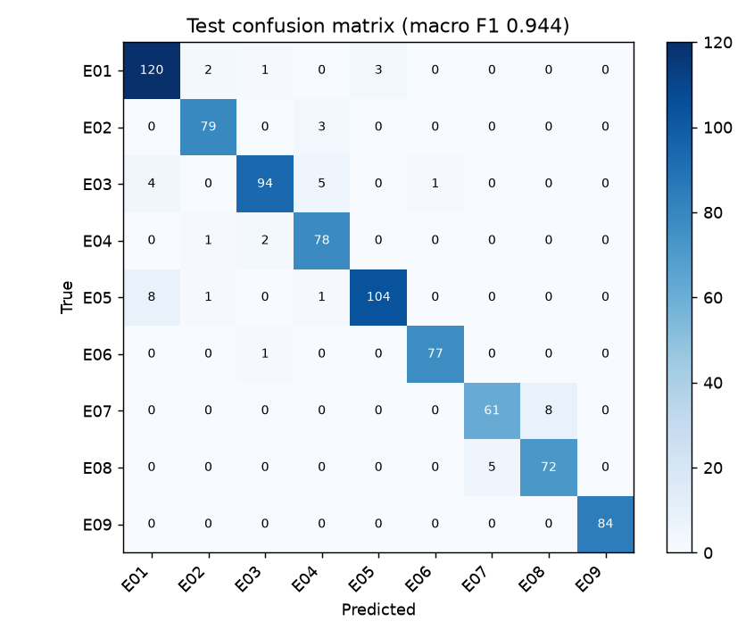
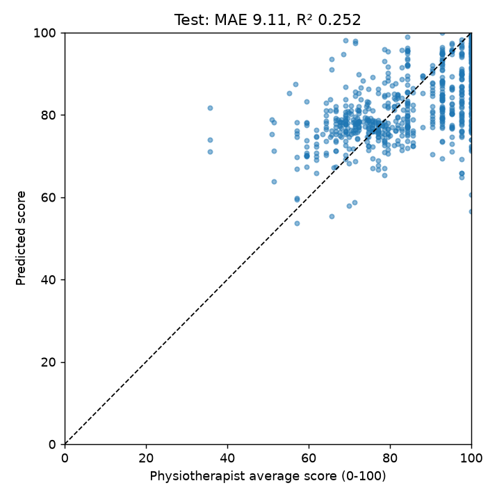

# Final test-set evaluation (held-out participants)

Test clips: 815 from 12 participants (['P11', 'P17', 'P18', 'P19', 'P23', 'P26', 'P30', 'P31', 'P33', 'P46', 'P52', 'P55'])

## Exercise classification

- accuracy: **0.944**
- macro F1: **0.944**
- macro precision / recall: 0.944 / 0.945

| class | precision | recall | F1 | support |
|---|---|---|---|---|
| E01 Abduction | 0.909 | 0.952 | 0.930 | 126 |
| E02 Adduction | 0.952 | 0.963 | 0.958 | 82 |
| E03 Lateral Rotation | 0.959 | 0.904 | 0.931 | 104 |
| E04 Medial Rotation | 0.897 | 0.963 | 0.929 | 81 |
| E05 Circumduction | 0.972 | 0.912 | 0.941 | 114 |
| E06 Wrist Extension | 0.987 | 0.987 | 0.987 | 78 |
| E07 Hip Joint Flexion | 0.924 | 0.884 | 0.904 | 69 |
| E08 Both Leg Flexion | 0.900 | 0.935 | 0.917 | 77 |
| E09 Back Extension | 1.000 | 1.000 | 1.000 | 84 |

By camera angle: front 0.955 (n=332), left 0.931 (n=232), right 0.940 (n=251)

By variation: full_light 0.924 (n=171), high_jitter 0.890 (n=109), low_jitter 0.959 (n=122), low_light 0.931 (n=130), low_resolution 0.800 (n=10), medium_light 0.986 (n=139), occlusion 0.978 (n=134)



## Movement quality (0-100)

- MAE: **9.11** (mean-predictor baseline 11.88)
- RMSE: **11.65**
- R²: **0.252**
- n scored test clips: 691

| exercise | MAE | RMSE | n |
|---|---|---|---|
| E01 Abduction | 7.85 | 10.00 | 80 |
| E02 Adduction | 11.71 | 14.33 | 82 |
| E03 Lateral Rotation | 8.19 | 9.79 | 80 |
| E04 Medial Rotation | 7.54 | 10.41 | 81 |
| E05 Circumduction | 8.76 | 10.23 | 82 |
| E06 Wrist Extension | 4.82 | 6.33 | 78 |
| E07 Hip Joint Flexion | 11.01 | 12.89 | 69 |
| E08 Both Leg Flexion | 6.94 | 9.88 | 70 |
| E09 Back Extension | 15.89 | 18.04 | 69 |

By camera angle: front 8.63 (n=238), left 9.70 (n=218), right 9.04 (n=235)

By variation: full_light 9.31 (n=125), high_jitter 9.77 (n=94), low_jitter 9.50 (n=106), low_light 8.24 (n=116), medium_light 9.18 (n=124), occlusion 8.80 (n=126)



## End-to-end pipeline on test clips

```json
{
  "n": 835,
  "status": {
    "analyzed": 815,
    "unable_to_analyze": 20
  },
  "observation_counts": {
    "inconsistent_repetitions": 385,
    "irregular_tempo": 364,
    "less_smooth_movement": 287,
    "asymmetric_movement": 102,
    "low_exercise_confidence": 25,
    "trunk_movement_during_arm_exercise": 12,
    "low_range_of_motion": 160,
    "fast_tempo": 38,
    "slow_tempo": 18,
    "few_repetitions_detected": 62,
    "low_predicted_quality": 10
  },
  "feedback_generated": 835
}
```
